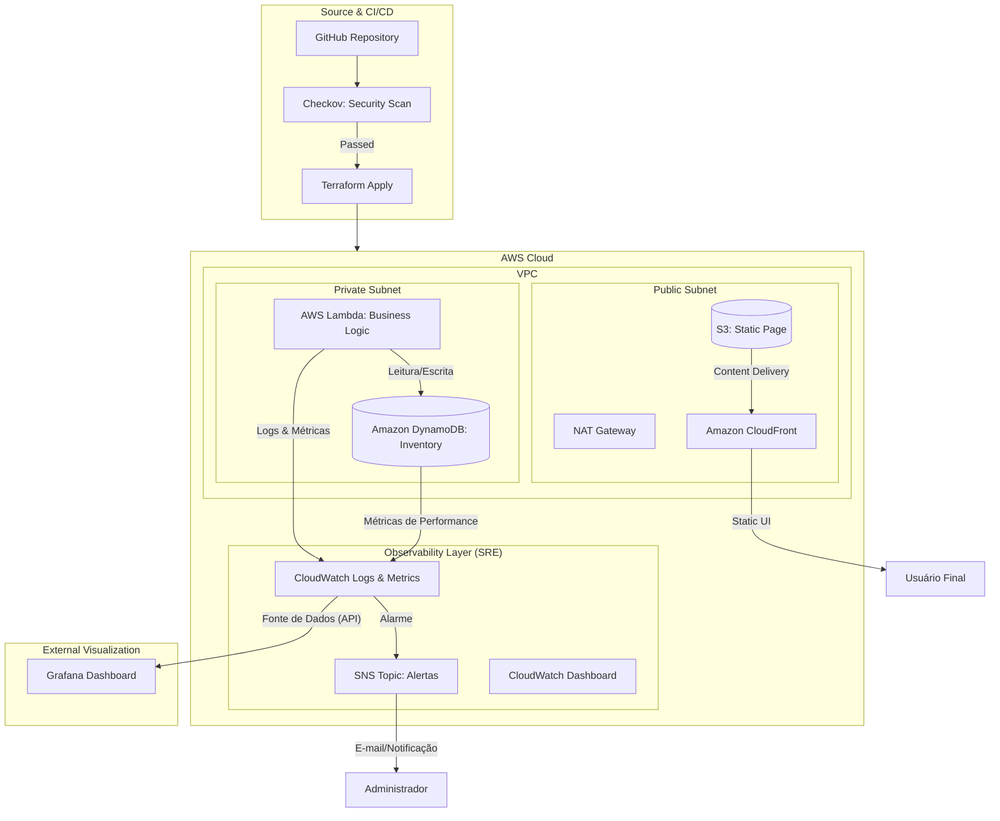

# Cloud-Retail Automator 

##  Sobre o Projeto
O **Cloud-Retail Automator** é uma solução de infraestrutura como código (IaC) e observabilidade projetada para resolver problemas reais de supply chain e varejo. [cite_start]Unindo mais de 20 anos de experiência em gestão de operações comerciais com as melhores práticas de Engenharia de Confiabilidade (SRE) e DevSecOps.

O sistema monitora níveis de estoque em tempo real e utiliza uma arquitetura orientada a eventos para disparar notificações inteligentes e gerar dashboards de performance.

##  Arquitetura do Sistema
Abaixo, a representação visual da infraestrutura provisionada via Terraform na AWS:

## Categoria,Ferramenta

Cloud,"AWS (DynamoDB, Lambda, SNS, S3, CloudFront)"
IaC,Terraform
Segurança,Checkov (Static Analysis)
Monitoramento,Grafana & CloudWatch
Containers,Docker (Local Dev Environment)

## DevSecOps & Segurança
Este projeto adota a mentalidade Shift-Left, integrando auditorias de segurança antes do provisionamento dos recursos. Utilizamos o Checkov para validar a conformidade da infraestrutura com as melhores práticas de segurança da AWS.